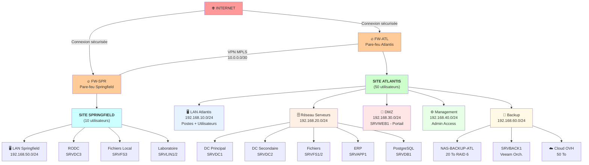
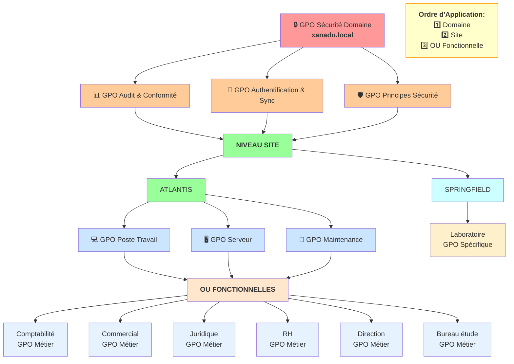
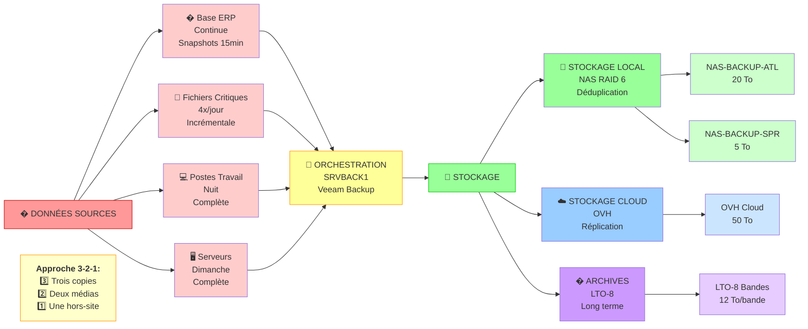

# LIVRABLE 1 - Cartographie du Système d'Information

## Administration et Sécurisation d'un système d'information
### Entreprise XANADU - Projet CESITECH

**Décembre 2025**

---

## Table des matières

1. [Résumé](#résumé)
2. [Introduction](#introduction)
3. [Cartographie du Système d'Information](#chapitre-1--cartographie-du-système-dinformation)
4. [Architecture Active Directory](#chapitre-2--architecture-active-directory)
5. [Stratégies de Groupe](#chapitre-3--stratégies-de-groupe)
6. [Plan de Sauvegarde](#chapitre-4--plan-de-sauvegarde)
7. [Garantie des Piliers de Sécurité](#chapitre-5--garantie-des-piliers-de-sécurité)
8. [Conclusion](#chapitre-6--conclusion)

---

## Résumé

Ce document présente la cartographie complète du système d'information cible pour l'entreprise **XANADU** dans le cadre de son projet de migration vers la technopole Atlantis. L'objectif principal est de proposer une architecture sécurisée, résiliente et facile à administrer qui garantisse la confidentialité, l'intégrité, la disponibilité et la traçabilité des données.

### Contenu du livrable

- La cartographie du système d'information avec le plan d'adressage TCP/IP
- L'architecture logique Active Directory avec les rôles FSMO
- La structure de l'annuaire (OU, groupes) et l'administration déléguée
- Les stratégies de groupe pour la sécurité et l'administration
- Le plan de sauvegarde et la topologie associée

Cette architecture respecte les bonnes pratiques en matière de sécurité informatique et répond aux exigences de continuité d'activité définies par la direction de XANADU.

**Mots-clés :** Active Directory, Sécurité, Cartographie, Plan de sauvegarde, Stratégies de groupe, XANADU, CESITECH

---

# Chapitre 1 – Introduction

## Contexte du projet

L'entreprise XANADU, spécialisée dans les services technologiques, compte **60 collaborateurs** répartis sur deux sites :
- **Site principal d'Atlantis** : 50 personnes
- **Site distant de Springfield** : 10 personnes

Dans le cadre de son déménagement vers la technopole Atlantis, la direction souhaite profiter de cette opportunité pour sécuriser et moderniser son système d'information.

## Objectifs du livrable

Ce livrable a pour objectif de présenter la cartographie complète du futur système d'information de XANADU, en se concentrant sur :

- Architecture réseau et plan d'adressage
- Structure Active Directory et administration déléguée
- Stratégies de sécurité et d'administration
- Plan de sauvegarde et continuité d'activité

## Contraintes et exigences

Le système d'information doit respecter les contraintes suivantes :

| Contrainte | Détail |
|-----------|--------|
| RTO critique | 4 heures pour les services critiques |
| RTO standard | 24 heures pour les autres services |
| Sécurité | Confidentialité, intégrité, disponibilité, traçabilité |
| Administration | Délégation au niveau de chaque service |
| Connectivité | Sécurisation inter-sites (Atlantis ↔ Springfield) |

---

# Chapitre 2 – Cartographie du Système d'Information

## Vue d'ensemble de l'architecture

L'architecture cible pour XANADU repose sur une approche **centralisée** avec redondance des services critiques. Le site principal d'Atlantis héberge la majorité des infrastructures tandis que le site de Springfield dispose des services essentiels pour son autonomie partielle.

## Plan d'adressage TCP/IP

### Réseaux définis

| Réseau | Adresse | Masque | Passerelle | Usage |
|--------|---------|--------|-----------|-------|
| LAN Atlantis | 192.168.10.0 | 255.255.255.0 | 192.168.10.1 | Postes Atlantis |
| Serveurs Atlantis | 192.168.20.0 | 255.255.255.0 | 192.168.20.1 | Serveurs principaux |
| DMZ | 192.168.30.0 | 255.255.255.0 | 192.168.30.1 | Serveurs exposés |
| Management | 192.168.40.0 | 255.255.255.0 | 192.168.40.1 | Administration |
| LAN Springfield | 192.168.50.0 | 255.255.255.0 | 192.168.50.1 | Postes Springfield |
| VPN Inter-sites | 10.0.0.0 | 255.255.255.252 | N/A | Liaison MPLS |
| Backup | 192.168.60.0 | 255.255.255.0 | 192.168.60.1 | Réseau sauvegarde |

### Allocation des adresses IP principales

| Équipement | Rôle | Adresse IP | Réseau |
|-----------|------|-----------|--------|
| SRVDC1 | DC principal | 192.168.20.10 | Serveurs |
| SRVDC2 | DC secondaire | 192.168.20.11 | Serveurs |
| SRVFS1 | Fichiers principal | 192.168.20.20 | Serveurs |
| SRVFS2 | Fichiers secondaire | 192.168.20.21 | Serveurs |
| SRVAPP1 | Application ERP | 192.168.20.30 | Serveurs |
| SRVDB1 | Base de données | 192.168.20.31 | Serveurs |
| SRVWEB1 | Portail web | 192.168.30.10 | DMZ |
| SRVDC3 | DC Springfield | 192.168.50.10 | LAN Springfield |
| SRVFS3 | Fichiers Springfield | 192.168.50.20 | LAN Springfield |
| FW-ATL | Pare-feu principal | 192.168.10.254 | LAN Atlantis |
| FW-SPR | Pare-feu Springfield | 192.168.50.254 | LAN Springfield |

## Architecture logique du réseau

Le système d'information XANADU est organisé en deux sites géographiquement distincts :



### Site principal - Atlantis

Le site principal concentre les serveurs critiques et dispose d'une connectivité Internet directe :

- **LAN Atlantis (192.168.10.0/24)** : Postes de travail, accès via pare-feu FW-ATL
- **Réseau Serveurs (192.168.20.0/24)** : Infrastructure critique (DC, fichiers, applications)
- **DMZ (192.168.30.0/24)** : Serveurs exposés à Internet, isolés du réseau interne
- **Réseau Management (192.168.40.0/24)** : Accès administratif sécurisé
- **Réseau Backup (192.168.60.0/24)** : Sauvegardes et stockage dédié

### Site distant - Springfield

Le site distant dispose d'une autonomie partielle via un contrôleur de domaine en lecture seule :

- **LAN Springfield (192.168.50.0/24)** : Postes de travail distant
- **Contrôleur RODC (SRVDC3)** : Authentification locale et cache des mots de passe
- **Serveur de fichiers local (SRVFS3)** : Cache pour performance locale

### Connectivité inter-sites

Les deux sites sont reliés par une liaison **VPN MPLS (10.0.0.0/30)** offrant :

- Chiffrement de bout en bout
- Qualité de service garantie
- Secours automatique en cas de défaillance

## Description des serveurs et services

### Serveurs principaux (Atlantis)

| Serveur | Rôle | Description |
|---------|------|-------------|
| SRVDC1 | Contrôleur de domaine | DC principal, FSMO, DNS, DHCP |
| SRVDC2 | Contrôleur de domaine | DC secondaire, DNS, réplication AD |
| SRVFS1 | Serveur de fichiers | Partages services, profils utilisateurs |
| SRVFS2 | Serveur de fichiers | Réplication DFS, sauvegardes fichiers |
| SRVAPP1 | Serveur d'applications | Frontend ERP, IIS |
| SRVDB1 | Base de données | PostgreSQL backend ERP |
| SRVWEB1 | Portail web | DMZ, accès externe ERP |
| SRVMON1 | Supervision | Zabbix, logs, métriques |
| SRVBACK1 | Sauvegarde | Veeam, orchestration backups |

### Serveurs site distant (Springfield)

| Serveur | Rôle | Description |
|---------|------|-------------|
| SRVDC3 | Contrôleur de domaine | RODC, cache AD, DNS local |
| SRVFS3 | Serveur de fichiers | Cache fichiers, partage local |
| SRVLIN1 | Serveur Linux | Équipements laboratoire |
| SRVLIN2 | Serveur Linux | Données laboratoire |

---

# Chapitre 3 – Architecture Active Directory

## Structure logique de l'annuaire

### Forêt et domaine

L'architecture Active Directory de XANADU est basée sur une structure simple avec une seule forêt et un seul domaine :

- **Forêt** : `xanadu.local`
- **Domaine** : `xanadu.local`
- **Niveau fonctionnel** : Windows Server 2019

Cette structure simplifiée facilite l'administration tout en offrant toutes les fonctionnalités nécessaires.

### Sites et sous-réseaux

| Site | Sous-réseau | Contrôleurs |
|------|-----------|------------|
| Atlantis | 192.168.10.0/24 | SRVDC1, SRVDC2 |
| | 192.168.20.0/24 | SRVDC1, SRVDC2 |
| | 192.168.30.0/24 | SRVDC1, SRVDC2 |
| | 192.168.40.0/24 | SRVDC1, SRVDC2 |
| | 192.168.60.0/24 | SRVDC1, SRVDC2 |
| Springfield | 192.168.50.0/24 | SRVDC3 (RODC) |

## Rôles FSMO

Les rôles FSMO sont centralisés sur **SRVDC1** pour garantir la cohérence :

| Rôle FSMO | Serveur | Description |
|-----------|---------|-------------|
| Emulateur PDC | SRVDC1 | Synchronisation temps |
| Maître RID | SRVDC1 | Allocation identifiants |
| Infrastructure | SRVDC1 | Références inter-domaines |
| Maître de nommage | SRVDC1 | Ajout/suppression domaines |
| Maître de schéma | SRVDC1 | Modifications du schéma AD |

### Architecture des contrôleurs de domaine

L'infrastructure Active Directory repose sur une architecture haute disponibilité :

```mermaid
graph TB
    ROOT["🌳 xanadu.local<br/><b>Forêt & Domaine</b><br/>Niveau 2019"]
    
    ROOT --> DC1["🔑 SRVDC1<br/><b>DC Principal - Atlantis</b>"]
    ROOT --> DC2["🔄 SRVDC2<br/><b>DC Secondaire - Atlantis</b>"]
    ROOT --> DC3["📖 SRVDC3<br/><b>RODC - Springfield</b>"]
    
    DC1 --> FSMO["<b>5 Rôles FSMO</b><br/>RID | PDC | Infrastructure<br/>Naming Master | Schema Master"]
    DC1 --|<b>Réplication<br/>Bidirectionnelle</b>| DC2
    DC2 --|<b>VPN MPLS<br/>Réplication</b>| DC3
    
    DC1 --> SRV1["<b>Services DNS/DHCP</b><br/>Primary"]
    DC2 --> SRV2["<b>Services DNS</b><br/>Secondary"]
    DC3 --> SRV3["<b>DNS Local<br/>Cache Mots de passe</b><br/>Authentication Locale"]
    
    DC1 -.->|Temps réel| SYNC1["Modifications critiques"]
    DC2 -.->|15 minutes| SYNC2["Changements standards"]
    DC3 -.->|VPN Sécurisé| SYNC3["Cache local"]
    
    style ROOT fill:#cc99ff
    style DC1 fill:#99ff99
    style DC2 fill:#99ffcc
    style DC3 fill:#ffcc99
    style FSMO fill:#ffff99
    style SYNC1 fill:#ff9999
    style SYNC2 fill:#ff9999
    style SYNC3 fill:#ff9999
```

- **SRVDC1 (Atlantis)** : Contrôleur principal avec les 5 rôles FSMO, héberge tous les maîtres d'opérations
- **SRVDC2 (Atlantis)** : Contrôleur secondaire en réplication bidirectionnelle avec SRVDC1, basculement automatique en cas de défaillance
- **SRVDC3 (Springfield)** : Contrôleur en lecture seule (RODC), réplication via liaison VPN MPLS, support de l'authentification locale

La réplication s'effectue en **temps réel** pour les modifications critiques et en intervalle de **15 minutes** pour les changements standards.

## Structure des Unités d'Organisation (OU)

La structure des OU est organisée selon une logique **géographique** puis **fonctionnelle** :

```mermaid
graph TD
    ROOT["📂 xanadu.local<br/>Domaine Racine"]
    
    ROOT --> ATL["📁 ATLANTIS<br/>Site Principal"]
    ROOT --> SPR["📁 SPRINGFIELD<br/>Site Distant"]
    
    ATL --> ATL_U["� Utilisateurs"]
    ATL --> ATL_C["� Ordinateurs"]
    ATL --> ATL_G["👫 Groupes"]
    ATL --> ATL_R["🎯 Ressources"]
    
    ATL_U --> COMPTA["Comptabilité<br/>15 users"]
    ATL_U --> COMM["Commercial<br/>12 users"]
    ATL_U --> JUR["Juridique<br/>3 users"]
    ATL_U --> RH["RH<br/>2 users"]
    ATL_U --> DIR["Direction<br/>3 users"]
    ATL_U --> BE["Bureau étude<br/>8 users"]
    
    ATL_C --> POSTES["Postes travail<br/>45 équipements"]
    ATL_C --> SRV["Serveurs<br/>9 équipements"]
    ATL_C --> PRINT["Imprimantes<br/>15 équipements"]
    
    ATL_G --> GG_C["GG_COMPTABILITE"]
    ATL_G --> GG_CO["GG_COMMERCIAL"]
    ATL_G --> GG_J["GG_JURIDIQUE"]
    ATL_G --> GG_RH_["GG_RH"]
    ATL_G --> GG_D["GG_DIRECTION"]
    ATL_G --> GG_B["GG_BUREAU_ETUDE"]
    
    SPR --> SPR_U["� Utilisateurs"]
    SPR --> SPR_C["💻 Ordinateurs"]
    SPR --> SPR_R["🎯 Ressources"]
    
    SPR_U --> LAB["Laboratoire<br/>10 users"]
    SPR_C --> SPR_POST["Postes travail<br/>10 équipements"]
    SPR_C --> SPR_SRV["Serveurs<br/>4 équipements"]
    SPR_R --> CACHE["Cache fichiers"]
    
    style ROOT fill:#cc99ff,stroke:#8833ff
    style ATL fill:#99ff99,stroke:#33cc00
    style SPR fill:#ffcc99,stroke:#ff9900
    style ATL_U fill:#e6f3ff
    style ATL_C fill:#e6ffe6
    style ATL_G fill:#ffe6f0
    style COMPTA fill:#cce5ff
    style COMM fill:#cce5ff
    style JUR fill:#cce5ff
    style RH fill:#cce5ff
    style DIR fill:#cce5ff
    style BE fill:#cce5ff
    style LAB fill:#fff0cc
```



## Types de comptes et rôles

### Comptes utilisateurs

| Type de compte | Description et droits |
|----------------|----------------------|
| Utilisateur standard | Accès applications métier, dossier personnel |
| Correspondant info | Gestion comptes service, droits admin limités |
| Admin service | Délégation complète sur son service OU |
| Admin domaine | Gestion complète AD, réservé CESITECH |
| Admin entreprise | Tous les droits, opérations critiques |

### Comptes de service

Des comptes dédiés sont créés pour chaque service applicatif avec des droits minimum nécessaires :

| Compte | Service | Droits |
|--------|---------|--------|
| svc_erp | Application ERP | Base de données, logs |
| svc_backup | Veeam Backup | Accès fichiers, VSS |
| svc_web | IIS Web | Fichiers web, anonyme |
| svc_sql | SQL Server | Admin base de données |
| svc_monitoring | Zabbix | Lecture compteurs, logs |

## Groupes de sécurité

Les groupes sont organisés selon une logique fonctionnelle pour faciliter la gestion des permissions :

### Groupes fonctionnels

| Groupe | Type | Description |
|--------|------|-------------|
| GG_COMPTABILITE | Sécurité | Service comptabilité |
| GG_COMMERCIAL | Sécurité | Équipe commerciale |
| GG_JURIDIQUE | Sécurité | Service juridique |
| GG_RH | Sécurité | Ressources humaines |
| GG_DIRECTION | Sécurité | Direction générale |
| GG_BUREAU_ETUDE | Sécurité | Bureau d'étude |
| GG_LABORATOIRE | Sécurité | Laboratoire Springfield |

### Groupes de permissions

| Groupe | Type | Permissions |
|--------|------|-------------|
| GG_ACCES_ERP | Sécurité | Accès application ERP |
| GG_VPN_USERS | Sécurité | Accès VPN distant |
| GG_CORRESP_INFO | Sécurité | Correspondants informatiques |
| GG_ADMIN_SERVICE | Sécurité | Administration déléguée service |
| GG_LECTURE_LABO | Sécurité | Lecture données laboratoire |

## Administration déléguée

L'administration déléguée est mise en œuvre via les stratégies de groupe et les délégations de contrôle sur les OU :

### Délégations configurées

- **Correspondants informatiques** : Gestion des comptes utilisateurs de leur service, réinitialisation mots de passe, gestion des groupes locaux
- **Administrateurs de service** : Administration complète de l'OU de leur service, gestion des partages, délégation de permissions
- **Équipe CESITECH** : Administration de l'ensemble du domaine, gestion des stratégies de groupe, maintenance des serveurs

### Permissions sur les partages

| Dossier | Groupe | Permissions |
|---------|--------|-------------|
| \Comptabilité | GG_COMPTABILITE | Modification |
| \Juridique | GG_JURIDIQUE | Modification |
| | GG_RH | Lecture |
| | GG_DIRECTION | Contrôle total |
| \RH | GG_RH | Modification |
| | GG_JURIDIQUE | Lecture |
| | GG_DIRECTION | Contrôle total |
| \Direction | GG_DIRECTION | Contrôle total |
| \Bureau_Etude | GG_BUREAU_ETUDE | Modification |
| | GG_LABORATOIRE | Lecture |
| \Laboratoire | GG_LABORATOIRE | Modification |
| | GG_BUREAU_ETUDE | Lecture |

---

# Chapitre 4 – Stratégies de Groupe

## Stratégies de sécurité

Les stratégies de groupe de sécurité visent à durcir le poste de travail et à réduire la surface d'attaque.

### GPO Sécurité Poste de Travail

| Paramètre | Configuration |
|-----------|---------------|
| Stratégie comptes | Complexité mots de passe, longueur min 12, historique 10 |
| Verrouillage compte | 3 tentatives, verrouillage 30 minutes |
| Contrôle d'accès | Désactiver invité, renommer administrateur |
| Exécution logiciels | Whitelist applications via AppLocker |
| Pare-feu Windows | Profil domaine activé, règles sortantes bloquées |
| Antivirus | Windows Defender activé, scans quotidiens |
| Mises à jour WSUS | Auto-approbation mises à jour critiques |

### GPO Sécurité Serveur

| Paramètre | Configuration |
|-----------|---------------|
| Stratégie comptes | Mots de passe 15 caractères min, durée 60 jours |
| Audit | Connexions réussies/échouées, privilèges, objets |
| Services réseau | Désactiver SMBv1, TLS 1.2 minimum |
| Pare-feu avancé | Règles entrantes restrictives, IPS activé |
| Windows Defender | Exclusions dossiers applicatifs |
| Remote Desktop | Chiffrement élevé, authentification réseau |

### GPO Sécurité Réseau

| Paramètre | Configuration |
|-----------|---------------|
| Wi-Fi Entreprise | WPA2-Enterprise, certificats clients |
| VPN Client | Configuration automatique VPN SSL |
| DNS | DNSSEC activé, serveurs DNS internes uniquement |
| Proxy | Configuration automatique proxy, filtrage contenu |

### GPO Sécurité Applications

| Paramètre | Configuration |
|-----------|---------------|
| Office | Macros désactivées par défaut, protection contre les macros |
| Navigateurs | Configuration sécurité renforcée, plugins désactivés |
| PDF Reader | JavaScript désactivé, intégration navigateur limitée |

### GPO Audit et Conformité

| Paramètre | Configuration |
|-----------|---------------|
| Audit stratégies | Succès et échec connexion, gestion comptes |
| Audit objets | Accès fichiers critiques, modifications stratégies |
| Audit processus | Création/terminaison processus, chargement drivers |
| Journalisation | Taille logs 500MB, ne pas effacer en cas de plein |
| Forwarding logs | Centralisation des événements de sécurité |

## Stratégies d'administration

### GPO Environnement Utilisateur

| Paramètre | Configuration |
|-----------|---------------|
| Lecteurs réseau | H: dossier personnel, S: partage service |
| Imprimantes | Déploiement automatique par service |
| Bureau | Raccourcis applications métiers |
| Menu Démarrer | Personnalisation par service |
| Fond d'écran | Charte graphique XANADU |

### GPO Déploiement Logiciels

| Logiciel | Configuration |
|----------|---------------|
| Office 365 | Déploiement automatique, sécurité activée |
| Antivirus | Installation forcée, mises à jour auto |
| VPN Client | Déploiement utilisateurs itinérants |
| Adobe Reader | Version sécurisée, JavaScript désactivé |
| 7-Zip | Utilitaire compression, chiffrement activé |

### GPO Maintenance Système

| Paramètre | Configuration |
|-----------|---------------|
| Planificateur | Défragmentation hebdomadaire, nettoyage disque mensuel |
| Windows Update | Installation automatique mises à jour critiques |
| Sauvegarde client | Configuration Veeam Endpoint, sauvegarde quotidienne |
| Performance | Alimentation haute performance, veille désactivée |

### GPO Restrictions Utilisateur

| Paramètre | Configuration |
|-----------|---------------|
| Panneau configuration | Accès limité aux utilisateurs standards |
| Registre | Édition désactivée pour utilisateurs standards |
| Gestionnaire de tâches | Accès en lecture seule pour utilisateurs standards |
| Installation logiciels | Désactivée pour tous sauf administrateurs |
| Périphériques USB | Stockage USB désactivé, claviers/souris autorisés |

### GPO Monitoring et Support

| Paramètre | Configuration |
|-----------|---------------|
| Agent Zabbix | Déploiement automatique, configuration centralisée |
| Télémétrie Windows | Données minimales, confidentialité préservée |
| Rapports d'erreur | Envoyer rapports erreurs critiques uniquement |
| Support à distance | TeamViewer Corporate déployé, accès restreint |

## Liaison des stratégies de groupe

Les stratégies de groupe sont liées hiérarchiquement aux unités d'organisation pour assurer l'application progressive des restrictions et configurations :



- **Au niveau domaine (xanadu.local)** : GPO Sécurité Domaine (audit, authentification)
- **Au niveau site (ATLANTIS)** : GPO Poste Travail, GPO Serveur
- **Au niveau OU fonctionnelle** : GPO Métier (Comptabilité, Commercial, etc.)
- **Au niveau OU Springfield** : GPO Laboratoire

Cet ordre d'application garantit que les paramètres domaine s'appliquent en premier, puis les paramètres locaux au site, puis les paramètres métier spécifiques.

---

# Chapitre 5 – Plan de Sauvegarde

## Classification des données et RTO/RPO

| Catégorie | Données | RTO | RPO | Fréquence |
|-----------|---------|-----|-----|-----------|
| Critiques | Base ERP, Données critiques | 4 heures | 1 heure | Continue |
| Importantes | Données services, Emails | 24 heures | 4 heures | 4x/jour |
| Moins critiques | Dossiers personnels | 24 heures | 24 heures | 1x/jour |

## Architecture de sauvegarde 3-2-1

L'architecture de sauvegarde repose sur une approche éprouvée :



- **3 copies des données** : Données originales + 2 copies de sauvegarde
- **2 types de médias différents** : Stockage local (NAS) + Stockage cloud
- **1 copie hors site** : Cloud hors site pour protection maximale

### Flux de sauvegarde

| Sources | Serveur Backup | Stockage Local | Stockage Externe |
|---------|----------------|----------------|------------------|
| Base ERP | SRVBACK1 | NAS Atlantis | Cloud OVH |
| Fichiers critiques | Veeam Orch. | NAS Springfield | Archives LTO-8 |
| Postes clients | Snapshots 15m | Compression | Conformité |
| | 3-2-1 Strategy | Déduplication | Souverain |

### Infrastructure de sauvegarde

| Équipement | Capacité | Rôle |
|-----------|----------|------|
| NAS-BACKUP-ATL | 20 To RAID 6 | Sauvegardes principales site Atlantis |
| NAS-BACKUP-SPR | 5 To RAID 6 | Sauvegardes locales Springfield |
| SRVBACK1 | 2 vCPU, 8 Go RAM | Orchestration Veeam, serveur de backup |
| Cloud OVH | 50 To | Sauvegardes externes, réplication |
| LTO-8 | 12 To par bande | Archives long terme, conformité |

## Stratégies de sauvegarde

### Sauvegardes continues

Pour les données critiques (base de données ERP) :

- Réplication continue vers NAS local
- Snapshots toutes les 15 minutes
- Réplication asynchrone vers cloud toutes les heures

### Sauvegardes incrémentales

Pour les données importantes :

- Sauvegarde incrémentale toutes les 4 heures
- Sauvegarde différentielle quotidienne à 23h
- Sauvegarde complète hebdomadaire le dimanche à 2h

### Sauvegardes complètes

Pour les données moins critiques :

- Sauvegarde complète quotidienne à 22h
- Compression et déduplication activées
- Rétention de 30 jours en local, 90 jours en cloud

## Plan de sauvegarde détaillé

| Source | Type | Fréquence | Horaire | Rétention locale | Rétention cloud |
|--------|------|-----------|---------|------------------|-----------------|
| Base ERP | Continue | Snapshots | 15 min | 7 jours | 30 jours |
| Fichiers critiques | Incrémentale | 4x/jour | 0h, 6h, 12h, 18h | 14 jours | 60 jours |
| Fichiers services | Différentielle | Quotidienne | 23h | 30 jours | 90 jours |
| Postes clients | Complète | Quotidienne | 22h | 7 jours | 30 jours |
| Serveurs | Complète | Hebdomadaire | Dimanche 2h | 4 semaines | 12 semaines |

## Procédures de restauration

### Restauration granulaire

- **Fichiers individuels** : Moins de 5 minutes
- **Dossiers complets** : Moins de 30 minutes
- **Boîtes mail** : Via Veeam Backup for Office 365

### Restauration complète

- **Poste de travail** : 2-4 heures
- **Serveur virtuel** : 4-6 heures
- **Site complet** : 24 heures (PRA)

---

# Chapitre 6 – Garantie des Piliers de Sécurité

## Framework CIDT (Confidentialité, Intégrité, Disponibilité, Traçabilité)

```mermaid
graph TB
    DATA["🔐 DONNÉES & INFORMATIONS XANADU"]
    
    DATA --> CONF["🔐 CONFIDENTIALITÉ"]
    DATA --> INT["✅ INTÉGRITÉ"]
    DATA --> DISPO["� DISPONIBILITÉ"]
    DATA --> TRACE["📊 TRAÇABILITÉ"]
    
    CONF --> CONF_AUTH["🔒 Authentification forte"]
    CONF --> CONF_ACL["🛡️ Contrôle d'accès"]
    CONF --> CONF_SEG["📍 Ségrégation données"]
    CONF --> CONF_ENC["🔑 Chiffrement<br/>BitLocker, SMB 3.0, AES-256"]
    CONF --> CONF_NET["🌐 VPN & Pare-feu"]
    CONF --> CONF_DMZ["🔐 DMZ isolée"]
    
    INT --> INT_PERM["🔒 Permissions NTFS"]
    INT --> INT_AUDIT["📋 Audit modifications"]
    INT --> INT_SIG["✍️ Signatures numériques"]
    INT --> INT_VERSION["📚 Versioning & Shadow Copy"]
    INT --> INT_SNAP["📸 Snapshots réguliers"]
    INT --> INT_CHECK["✔️ Contrôle intégrité"]
    
    DISPO --> DISPO_RED["🔴 Redondance matérielle"]
    DISPO --> DISPO_RAID["💾 RAID 6"]
    DISPO --> DISPO_CLUSTER["⚙️ Cluster HA"]
    DISPO --> DISPO_LB["⚖️ Load Balancing"]
    DISPO --> DISPO_RTO["⏱️ RTO 4h"]
    DISPO --> DISPO_RPO["⏱️ RPO 1h"]
    
    TRACE --> TRACE_LOG["📁 Journalisation centralisée"]
    TRACE --> TRACE_AUDIT_L["📊 Audit connexions"]
    TRACE --> TRACE_PERM_L["🔐 Audit permissions"]
    TRACE --> TRACE_ACCESS["📖 Audit accès données"]
    TRACE --> TRACE_ALERT["⚠️ Alertes temps réel"]
    TRACE --> TRACE_REPORT["📈 Rapports mensuels"]
    
    style DATA fill:#ff99cc,stroke:#cc0066
    style CONF fill:#ff9999,stroke:#cc0000
    style INT fill:#99ff99,stroke:#00cc00
    style DISPO fill:#99ff99,stroke:#00cc00
    style TRACE fill:#99ccff,stroke:#0066cc
    
    style CONF_AUTH fill:#ffcccc
    style CONF_ACL fill:#ffcccc
    style CONF_SEG fill:#ffcccc
    style CONF_ENC fill:#ffcccc
    style CONF_NET fill:#ffcccc
    style CONF_DMZ fill:#ffcccc
    
    style INT_PERM fill:#ccffcc
    style INT_AUDIT fill:#ccffcc
    style INT_SIG fill:#ccffcc
    style INT_VERSION fill:#ccffcc
    style INT_SNAP fill:#ccffcc
    style INT_CHECK fill:#ccffcc
    
    style DISPO_RED fill:#ccffcc
    style DISPO_RAID fill:#ccffcc
    style DISPO_CLUSTER fill:#ccffcc
    style DISPO_LB fill:#ccffcc
    style DISPO_RTO fill:#ccffcc
    style DISPO_RPO fill:#ccffcc
    
    style TRACE_LOG fill:#cce5ff
    style TRACE_AUDIT_L fill:#cce5ff
    style TRACE_PERM_L fill:#cce5ff
    style TRACE_ACCESS fill:#cce5ff
    style TRACE_ALERT fill:#cce5ff
    style TRACE_REPORT fill:#cce5ff
```



## Confidentialité

La confidentialité des données est garantie par plusieurs mesures :

### Contrôle d'accès

- Authentification forte avec mots de passe complexes
- Autorisations basées sur le principe du moindre privilège
- Ségrégation des données par service via les partages NTFS
- Chiffrement BitLocker sur les postes portables

### Protection réseau

- Segmentation réseau avec VLANs par niveau de sensibilité
- Filtrage pare-feu entre les zones réseau
- VPN avec chiffrement pour les accès distants
- Isolation de la DMZ pour les serveurs exposés

### Chiffrement des données

- Chiffrement des bases de données (PostgreSQL)
- Chiffrement des partages réseau (SMB 3.0)
- Chiffrement des sauvegardes (AES-256)
- Certificats pour les communications web (HTTPS)

## Intégrité

L'intégrité des données est assurée par :

### Contrôles d'accès

- Permissions NTFS granulaires sur les fichiers
- Audit des modifications de fichiers critiques
- Validation des entrées dans les applications
- Signatures numériques pour les documents importants

### Surveillance

- Monitoring des modifications de l'Active Directory
- Alertes en cas de changements de permissions
- Journalisation des accès aux données sensibles
- Contrôle d'intégrité des sauvegardes

### Versioning

- Shadow Copy pour les partages réseau
- Historique des versions dans SharePoint
- Snapshots réguliers des machines virtuelles
- Archives immuables pour données réglementaires

## Disponibilité

La disponibilité est garantie par :

### Redondance matérielle

- Double contrôleur de domaine sur le site principal
- RAID 6 pour les stockages critiques
- Alimentations et onduleurs redondants
- Liaisons réseau multiples

### Haute disponibilité logicielle

- Cluster de base de données PostgreSQL
- Réplication DFS pour les partages
- Load balancing pour les serveurs web
- Services automatiques de redémarrage

### Plan de continuité

- RTO de 4 heures pour services critiques
- PRA avec basculement automatique
- Documentation des procédures de recovery
- Tests réguliers du plan de continuité

## Traçabilité

La traçabilité est assurée par :

### Journalisation centralisée

- Collecte des logs Windows Event Forwarding
- Centralisation sur serveur de monitoring
- Conservation des logs 1 an minimum
- Agrégation logs applicatifs et système

### Audit des actions

- Audit des connexions réussies/échouées
- Audit des modifications de permissions
- Audit des accès aux fichiers sensibles
- Audit des changements de configuration

### Reporting

- Tableaux de bord de sécurité quotidiens
- Alertes en temps réel sur événements critiques
- Rapports de conformité mensuels
- Analyse des tendances et anomalies

---

# Chapitre 7 – Conclusion

## Synthèse de la solution proposée

Ce livrable présente une architecture complète et sécurisée pour le système d'information de XANADU. La solution proposée répond à l'ensemble des exigences du cahier des charges tout en intégrant les meilleures pratiques en matière de sécurité informatique.

## Points forts de l'architecture

- **Sécurité multicouche** : De la protection réseau jusqu'au chiffrement des données
- **Résilience** : Redondance des services critiques et plan de continuité complet
- **Administration déléguée** : Autonomie des services tout en maîtrisant la sécurité
- **Scalabilité** : Architecture modulaire capable d'évoluer avec l'entreprise
- **Conformité** : Respect des bonnes pratiques et réglementations

## Prochaines étapes

La mise en œuvre nécessitera :

1. Validation de la conception par la direction de XANADU
2. Déploiement de l'infrastructure de base
3. Migration des données et applications
4. Formation des administrateurs et utilisateurs
5. Tests de validation et recette de la solution

## Bénéfices attendus

L'implémentation permettra à XANADU de :

- Sécuriser son système d'information contre les menaces actuelles
- Garantir la continuité de ses activités métier
- Simplifier l'administration quotidienne
- Réduire les coûts de gestion et maintenance
- Se conformer aux exigences réglementaires

Cette solution constitue une base solide pour la transformation numérique de XANADU tout en assurant la sécurité et la pérennité de son système d'information.

---

**Document généré le : 5 décembre 2025**  
**Projet CESITECH - Équipe projet**  
**Entreprise XANADU**
