# LIVRABLE 1 - Cartographie du Système d'Information

## Administration et Sécurisation d'un système d'information
### Entreprise XANADU - Projet CESITECH

**Décembre 2025**

---

## Table des matières

1. [Résumé](#résumé)
2. [Introduction et Contexte](#chapitre-0--introduction-et-contexte)
3. [Cartographie du Système d'Information](#chapitre-1--cartographie-du-système-dinformation)
4. [Architecture Active Directory](#chapitre-2--architecture-active-directory)
5. [Stratégies de Groupe](#chapitre-3--stratégies-de-groupe)
6. [Plan de Sauvegarde](#chapitre-4--plan-de-sauvegarde)
7. [Sécurité Réseau](#chapitre-5--sécurité-réseau-et-politique-de-filtrage)
8. [Garantie des Piliers de Sécurité](#chapitre-6--garantie-des-piliers-de-sécurité)
9. [Plan de Continuité et PRA](#chapitre-7--plan-de-continuité-et-plan-de-reprise-dactivité)
10. [Conclusion](#chapitre-8--conclusion)

---

## Résumé

Ce document présente la cartographie complète du système d'information cible pour l'entreprise **XANADU** dans le cadre de son projet de migration vers la technopole Atlantis. L'objectif principal est de proposer une architecture sécurisée, résiliente et facile à administrer qui garantisse la confidentialité, l'intégrité, la disponibilité et la traçabilité des données.

### Contenu du livrable

- La cartographie du système d'information avec le plan d'adressage TCP/IP
- L'architecture logique Active Directory avec les rôles FSMO
- La structure de l'annuaire (OU, groupes) et l'administration déléguée
- Les stratégies de groupe pour la sécurité et l'administration
- Le plan de sauvegarde et la topologie associée

Cette architecture respecte les bonnes pratiques en matière de sécurité informatique et répond aux exigences de continuité d'activité définies par la direction de XANADU.

**Mots-clés :** Active Directory, Sécurité, Cartographie, Plan de sauvegarde, Stratégies de groupe, XANADU, CESITECH

---

# Chapitre 0 – Introduction et Contexte

## Contexte du projet

L'entreprise XANADU, spécialisée dans les services technologiques, compte **60 collaborateurs** répartis sur deux sites :
- **Site principal d'Atlantis** : 50 personnes
- **Site distant de Springfield** : 10 personnes

Dans le cadre de son déménagement vers la technopole Atlantis, la direction souhaite profiter de cette opportunité pour sécuriser et moderniser son système d'information.

### Les 7 services organisationnels de XANADU

XANADU est structuré selon 7 services/divisions :

1. **Comptabilité et Gestion financière** – 15 utilisateurs
2. **Commercial** – 12 utilisateurs  
3. **Bureau d'étude** – 8 utilisateurs
4. **Juridique** – 3 utilisateurs
5. **Ressources Humaines (RH)** – 2 utilisateurs
6. **Direction générale** – 3 utilisateurs
7. **Laboratoire** (Springfield distant) – 10 utilisateurs

Chaque service dispose d'un dossier partagé dédié et d'un correspondant informatique responsable de la gestion des comptes et des droits d'accès.

## Objectifs du livrable

Ce livrable a pour objectif de présenter la cartographie complète du futur système d'information de XANADU, en se concentrant sur :

- Architecture réseau et plan d'adressage
- Structure Active Directory et administration déléguée
- Stratégies de sécurité et d'administration
- Plan de sauvegarde et continuité d'activité

## Contraintes et exigences

Le système d'information doit respecter les contraintes suivantes :

| Contrainte | Détail |
|-----------|--------|
| RTO critique | 4 heures pour les services critiques |
| RTO standard | 24 heures pour les autres services |
| Sécurité | Confidentialité, intégrité, disponibilité, traçabilité |
| Administration | Délégation au niveau de chaque service |
| Connectivité | Sécurisation inter-sites (Atlantis ↔ Springfield) |

---

# Chapitre 1 – Cartographie du Système d'Information

## Vue d'ensemble de l'architecture

L'architecture cible pour XANADU repose sur une approche **centralisée** avec redondance des services critiques. Le site principal d'Atlantis héberge la majorité des infrastructures tandis que le site de Springfield dispose des services essentiels pour son autonomie partielle.

## Plan d'adressage TCP/IP

### Réseaux définis

| Réseau | Adresse | Masque | Passerelle | Usage |
|--------|---------|--------|-----------|-------|
| LAN Atlantis | 192.168.10.0 | 255.255.255.0 | 192.168.10.1 | Postes Atlantis |
| Serveurs Atlantis | 192.168.20.0 | 255.255.255.0 | 192.168.20.1 | Serveurs principaux |
| DMZ | 192.168.30.0 | 255.255.255.0 | 192.168.30.1 | Serveurs exposés |
| Management | 192.168.40.0 | 255.255.255.0 | 192.168.40.1 | Administration |
| LAN Springfield | 192.168.50.0 | 255.255.255.0 | 192.168.50.1 | Postes Springfield |
| VPN Inter-sites | 10.0.0.0 | 255.255.255.252 | N/A | Liaison MPLS |
| Backup | 192.168.60.0 | 255.255.255.0 | 192.168.60.1 | Réseau sauvegarde |

### Allocation des adresses IP principales

| Équipement | Rôle | Adresse IP | Réseau |
|-----------|------|-----------|--------|
| SRVDC1 | DC principal | 192.168.20.10 | Serveurs |
| SRVDC2 | DC secondaire | 192.168.20.11 | Serveurs |
| SRVFS1 | Fichiers principal | 192.168.20.20 | Serveurs |
| SRVFS2 | Fichiers secondaire | 192.168.20.21 | Serveurs |
| SRVAPP1 | Application ERP | 192.168.20.30 | Serveurs |
| SRVDB1 | Base de données | 192.168.20.31 | Serveurs |
| SRVWEB1 | Portail web | 192.168.30.10 | DMZ |
| SRVDC3 | DC Springfield | 192.168.50.10 | LAN Springfield |
| SRVFS3 | Fichiers Springfield | 192.168.50.20 | LAN Springfield |
| FW-ATL | Pare-feu principal | 192.168.10.254 | LAN Atlantis |
| FW-SPR | Pare-feu Springfield | 192.168.50.254 | LAN Springfield |

## Architecture logique du réseau

Le système d'information XANADU est organisé en deux sites géographiquement distincts :


### Site principal - Atlantis

Le site principal concentre les serveurs critiques et dispose d'une connectivité Internet directe :

- **LAN Atlantis (192.168.10.0/24)** : Postes de travail, accès via pare-feu FW-ATL
- **Réseau Serveurs (192.168.20.0/24)** : Infrastructure critique (DC, fichiers, applications)
- **DMZ (192.168.30.0/24)** : Serveurs exposés à Internet, isolés du réseau interne
- **Réseau Management (192.168.40.0/24)** : Accès administratif sécurisé
- **Réseau Backup (192.168.60.0/24)** : Sauvegardes et stockage dédié

### Site distant - Springfield

Le site distant dispose d'une autonomie partielle via un contrôleur de domaine en lecture seule :

- **LAN Springfield (192.168.50.0/24)** : Postes de travail distant
- **Contrôleur RODC (SRVDC3)** : Authentification locale et cache des mots de passe
- **Serveur de fichiers local (SRVFS3)** : Cache pour performance locale

### Connectivité inter-sites

Les deux sites sont reliés par une liaison **VPN MPLS (10.0.0.0/30)** offrant :

- Chiffrement de bout en bout
- Qualité de service garantie
- Secours automatique en cas de défaillance

## Description des serveurs et services

### Serveurs principaux (Atlantis)

| Serveur | Rôle | Description |
|---------|------|-------------|
| SRVDC1 | Contrôleur de domaine | DC principal, FSMO, DNS, DHCP |
| SRVDC2 | Contrôleur de domaine | DC secondaire, DNS, réplication AD |
| SRVFS1 | Serveur de fichiers | Partages services, profils utilisateurs |
| SRVFS2 | Serveur de fichiers | Réplication DFS, sauvegardes fichiers |
| SRVAPP1 | Serveur d'applications | Frontend ERP (Odoo), IIS |
| SRVDB1 | Base de données | PostgreSQL backend ERP (10 Go) |
| SRVWEB1 | Portail web | DMZ, accès externe ERP en HTTPS |
| SRVMON1 | Supervision | Zabbix, logs centralisés, alertes |
| SRVBACK1 | Sauvegarde | Veeam Backup, orchestration 3-2-1 |

### Serveurs site distant (Springfield)

| Serveur | Rôle | Description |
|---------|------|-------------|
| SRVDC3 | Contrôleur de domaine | RODC, cache AD, DNS local, authentification locale |
| SRVFS3 | Serveur de fichiers | Cache fichiers, partage laboratoire local |
| SRVLIN1 | Serveur Linux | Pilotage équipements laboratoire |
| SRVLIN2 | Serveur Linux | Collecte données laboratoire |

## Infrastructure de stockage et équipements réseau

### NAS et Stockage

| Équipement | Capacité | Configuration | Rôle |
|-----------|----------|--------------|------|
| NAS-FILES-ATL | 800 Go (actuellement) → 2 To | RAID 6, 2 x 1 Go Ethernet | Partages métier + profils |
| NAS-BACKUP-ATL | 20 To | RAID 6, SMB3 chiffré | Sauvegardes locales Atlantis |
| NAS-BACKUP-SPR | 5 To | RAID 6, accès local | Sauvegardes locales Springfield |
| Stockage Cloud OVH | 50 To | Chiffrement AES-256 | Sauvegardes externalisées |
| Archives LTO-8 | 12 To/bande | Immuable, long terme | Conformité, archivage légal |

### Équipements Réseau

| Équipement | Fonction | Spécifications |
|-----------|----------|----------------|
| FW-ATL | Pare-feu Atlantis | Filtrage avancé, IDPS, proxy UTM |
| FW-SPR | Pare-feu Springfield | Filtrage entrant/sortant, IDPS |
| ROUTEUR | Accès Internet + VPN MPLS | Box fibre + L3VPN opérateur SLA 99.9% |
| COPIEUR | Impression/numérisation | Réseau Management, VLAN 40 |
| IMPRIMANTE | Impression couleur | Réseau Management, VLAN 40 |

### Infrastructure Hyperviseur

| Composant | Spécifications | Usage |
|-----------|----------------|-------|
| HYPERVISEUR | ESXi 7.0 | Hébergement VMs ERP |
| SRVAPP1-VM | 4 vCPU, 8 Go RAM | Odoo application (haute disponibilité) |
| SRVDB1-VM | 8 vCPU, 16 Go RAM | PostgreSQL + SSD pour perfs |
| SRVBACK1-VM | 2 vCPU, 8 Go RAM | Orchestration Veeam |
| SRVMON1-VM | 2 vCPU, 4 Go RAM | Zabbix + logs centralisés |
| Snapshots | Quotidiens | Protection contre rançongiciels |

## Volumes de données

### Données actuelles

| Type de données | Volume | Croissance annuelle estimée |
|-----------------|--------|---------------------------|
| Partages métier | 800 Go | +15% (120 Go/an) |
| Dossiers personnels (60 users × 5 Go) | 300 Go | +10% (30 Go/an) |
| Base ERP PostgreSQL | 10 Go | +25% (2.5 Go/an) |
| Profils utilisateurs | 50 Go | +5% |
| **Total** | **1.16 To** | **~150 Go/an** |

---

# Chapitre 2 – Architecture Active Directory

## Structure logique de l'annuaire

### Forêt et domaine

L'architecture Active Directory de XANADU est basée sur une structure simple avec une seule forêt et un seul domaine :

- **Forêt** : `xanadu.local`
- **Domaine** : `xanadu.local`
- **Niveau fonctionnel** : Windows Server 2019

Cette structure simplifiée facilite l'administration tout en offrant toutes les fonctionnalités nécessaires.

### Sites et sous-réseaux

| Site | Sous-réseau | Contrôleurs |
|------|-----------|------------|
| Atlantis | 192.168.10.0/24 | SRVDC1, SRVDC2 |
| | 192.168.20.0/24 | SRVDC1, SRVDC2 |
| | 192.168.30.0/24 | SRVDC1, SRVDC2 |
| | 192.168.40.0/24 | SRVDC1, SRVDC2 |
| | 192.168.60.0/24 | SRVDC1, SRVDC2 |
| Springfield | 192.168.50.0/24 | SRVDC3 (RODC) |

## Rôles FSMO

Les rôles FSMO sont centralisés sur **SRVDC1** pour garantir la cohérence :

| Rôle FSMO | Serveur | Description |
|-----------|---------|-------------|
| Emulateur PDC | SRVDC1 | Synchronisation temps |
| Maître RID | SRVDC1 | Allocation identifiants |
| Infrastructure | SRVDC1 | Références inter-domaines |
| Maître de nommage | SRVDC1 | Ajout/suppression domaines |
| Maître de schéma | SRVDC1 | Modifications du schéma AD |

### Architecture des contrôleurs de domaine

L'infrastructure Active Directory repose sur une architecture haute disponibilité :


- **SRVDC1 (Atlantis)** : Contrôleur principal avec les 5 rôles FSMO, héberge tous les maîtres d'opérations
- **SRVDC2 (Atlantis)** : Contrôleur secondaire en réplication bidirectionnelle avec SRVDC1, basculement automatique en cas de défaillance
- **SRVDC3 (Springfield)** : Contrôleur en lecture seule (RODC), réplication via liaison VPN MPLS, support de l'authentification locale

La réplication s'effectue en **temps réel** pour les modifications critiques et en intervalle de **15 minutes** pour les changements standards.

## Structure des Unités d'Organisation (OU)

La structure des OU est organisée selon une logique **géographique** puis **fonctionnelle** selon les 7 services de XANADU :


## Types de comptes et rôles

### Comptes utilisateurs

| Type de compte | Description et droits |
|----------------|----------------------|
| Utilisateur standard | Accès applications métier, dossier personnel |
| Correspondant info | Gestion comptes service, droits admin limités |
| Admin service | Délégation complète sur son service OU |
| Admin domaine | Gestion complète AD, réservé CESITECH |
| Admin entreprise | Tous les droits, opérations critiques |

### Comptes de service

Des comptes dédiés sont créés pour chaque service applicatif avec des droits minimum nécessaires :

| Compte | Service | Droits |
|--------|---------|--------|
| svc_erp | Application ERP | Base de données, logs |
| svc_backup | Veeam Backup | Accès fichiers, VSS |
| svc_web | IIS Web | Fichiers web, anonyme |
| svc_sql | SQL Server | Admin base de données |
| svc_monitoring | Zabbix | Lecture compteurs, logs |

## Groupes de sécurité

Les groupes sont organisés selon une logique fonctionnelle pour faciliter la gestion des permissions :

### Groupes fonctionnels (7 services XANADU)

| Groupe | Type | Description | Correspondant IT |
|--------|------|-------------|------------------|
| GG_COMPTABILITE | Sécurité | Service comptabilité (15 users) | Désigné par direction |
| GG_COMMERCIAL | Sécurité | Équipe commerciale (12 users) | Désigné par direction |
| GG_JURIDIQUE | Sécurité | Service juridique (3 users) | Désigné par direction |
| GG_RH | Sécurité | Ressources humaines (2 users) | Désigné par direction |
| GG_DIRECTION | Sécurité | Direction générale (3 users) | Désigné par direction |
| GG_BUREAU_ETUDE | Sécurité | Bureau d'étude (8 users) | Désigné par direction |
| GG_LABORATOIRE | Sécurité | Laboratoire Springfield (10 users) | Désigné par direction |

### Groupes de permissions

| Groupe | Type | Permissions |
|--------|------|-------------|
| GG_ACCES_ERP | Sécurité | Accès application ERP |
| GG_VPN_USERS | Sécurité | Accès VPN distant |
| GG_CORRESP_INFO | Sécurité | Correspondants informatiques |
| GG_ADMIN_SERVICE | Sécurité | Administration déléguée service |
| GG_LECTURE_LABO | Sécurité | Lecture données laboratoire |

## Administration déléguée

L'administration déléguée est mise en œuvre via les stratégies de groupe et les délégations de contrôle sur les OU. Chaque service possède un correspondant IT qui peut :

### Pouvoirs du correspondant IT par service

Pour chaque service (Comptabilité, Commercial, Juridique, RH, Direction, Bureau d'étude, Laboratoire) :

**Délégations configurées :**

- **Créer et modifier les comptes utilisateurs** de leur service dans l'OU correspondante
- **Gérer les groupes locaux** et adhésion aux groupes de sécurité de leur service  
- **Réinitialiser les mots de passe** des utilisateurs de leur service
- **Gérer les droits d'accès** aux ressources de leur service (partages, imprimantes)
- **Intégrer les nouveaux ordinateurs** au domaine pour leur service
- **Créer les sous-dossiers** et gérer les partages fichiers du service

**Restrictions :**

- Aucun accès aux services autres (sauf ce qui est partagé explicitement)
- Aucune modification de stratégies de groupe
- Aucune modification des délégations de contrôle
- Aucune gestion des comptes de service ou comptes d'administration domaine

### Équipe CESITECH (Administration centrale)

- **Administration de l'ensemble du domaine**
- **Gestion des stratégies de groupe** au niveau domaine et site
- **Maintenance des serveurs** et infrastructure AD
- **Surveillance et audit** de la sécurité AD
- **Gestion des comptes de service** et comptes d'administration
- **Backup et restore** des configurations AD

### Permissions sur les partages

Les partages de fichiers sont configurés avec un modèle de permissions suivant les 7 services de XANADU :

| Dossier | Groupe | Permissions |
|---------|--------|-------------|
| \Comptabilité | GG_COMPTABILITE | Modification |
| | GG_DIRECTION | Contrôle total |
| \Commercial | GG_COMMERCIAL | Modification |
| | GG_DIRECTION | Contrôle total |
| \Juridique | GG_JURIDIQUE | Modification |
| | GG_COMMERCIAL | Lecture |
| | GG_RH | Lecture |
| | GG_DIRECTION | Contrôle total |
| \RH | GG_RH | Modification |
| | GG_JURIDIQUE | Lecture |
| | GG_DIRECTION | Contrôle total |
| \Direction | GG_DIRECTION | Contrôle total |
| \Bureau_Etude | GG_BUREAU_ETUDE | Modification |
| | GG_LABORATOIRE | Lecture |
| | GG_DIRECTION | Contrôle total |
| \Laboratoire | GG_LABORATOIRE | Modification |
| | GG_BUREAU_ETUDE | Lecture |
| | GG_DIRECTION | Contrôle total |
| \Personnel | Chaque utilisateur | Modification (dossier personnel) |
| | GG_DIRECTION | Contrôle total |

---

# Chapitre 3 – Stratégies de Groupe

## Stratégies de sécurité

Les stratégies de groupe de sécurité visent à durcir le poste de travail et à réduire la surface d'attaque.

### GPO Sécurité Poste de Travail

| Paramètre | Configuration |
|-----------|---------------|
| Stratégie comptes | Complexité mots de passe, longueur min 12, historique 10 |
| Verrouillage compte | 3 tentatives, verrouillage 30 minutes |
| Contrôle d'accès | Désactiver invité, renommer administrateur |
| Exécution logiciels | Whitelist applications via AppLocker |
| Pare-feu Windows | Profil domaine activé, règles sortantes bloquées |
| Antivirus | Windows Defender activé, scans quotidiens |
| Mises à jour WSUS | Auto-approbation mises à jour critiques |

### GPO Sécurité Serveur

| Paramètre | Configuration |
|-----------|---------------|
| Stratégie comptes | Mots de passe 15 caractères min, durée 60 jours |
| Audit | Connexions réussies/échouées, privilèges, objets |
| Services réseau | Désactiver SMBv1, TLS 1.2 minimum |
| Pare-feu avancé | Règles entrantes restrictives, IPS activé |
| Windows Defender | Exclusions dossiers applicatifs |
| Remote Desktop | Chiffrement élevé, authentification réseau |

### GPO Sécurité Réseau

| Paramètre | Configuration |
|-----------|---------------|
| Wi-Fi Entreprise | WPA2-Enterprise, certificats clients |
| VPN Client | Configuration automatique VPN SSL |
| DNS | DNSSEC activé, serveurs DNS internes uniquement |
| Proxy | Configuration automatique proxy, filtrage contenu |

### GPO Sécurité Applications

| Paramètre | Configuration |
|-----------|---------------|
| Office | Macros désactivées par défaut, protection contre les macros |
| Navigateurs | Configuration sécurité renforcée, plugins désactivés |
| PDF Reader | JavaScript désactivé, intégration navigateur limitée |

### GPO Audit et Conformité

| Paramètre | Configuration |
|-----------|---------------|
| Audit stratégies | Succès et échec connexion, gestion comptes |
| Audit objets | Accès fichiers critiques, modifications stratégies |
| Audit processus | Création/terminaison processus, chargement drivers |
| Journalisation | Taille logs 500MB, ne pas effacer en cas de plein |
| Forwarding logs | Centralisation des événements de sécurité |

## Stratégies d'administration

### GPO Environnement Utilisateur

| Paramètre | Configuration |
|-----------|---------------|
| Lecteurs réseau | H: dossier personnel, S: partage service |
| Imprimantes | Déploiement automatique par service |
| Bureau | Raccourcis applications métiers |
| Menu Démarrer | Personnalisation par service |
| Fond d'écran | Charte graphique XANADU |

### GPO Déploiement Logiciels

| Logiciel | Configuration |
|----------|---------------|
| Office 365 | Déploiement automatique, sécurité activée |
| Antivirus | Installation forcée, mises à jour auto |
| VPN Client | Déploiement utilisateurs itinérants |
| Adobe Reader | Version sécurisée, JavaScript désactivé |
| 7-Zip | Utilitaire compression, chiffrement activé |

### GPO Maintenance Système

| Paramètre | Configuration |
|-----------|---------------|
| Planificateur | Défragmentation hebdomadaire, nettoyage disque mensuel |
| Windows Update | Installation automatique mises à jour critiques |
| Sauvegarde client | Configuration Veeam Endpoint, sauvegarde quotidienne |
| Performance | Alimentation haute performance, veille désactivée |

### GPO Restrictions Utilisateur

| Paramètre | Configuration |
|-----------|---------------|
| Panneau configuration | Accès limité aux utilisateurs standards |
| Registre | Édition désactivée pour utilisateurs standards |
| Gestionnaire de tâches | Accès en lecture seule pour utilisateurs standards |
| Installation logiciels | Désactivée pour tous sauf administrateurs |
| Périphériques USB | Stockage USB désactivé, claviers/souris autorisés |

### GPO Monitoring et Support

| Paramètre | Configuration |
|-----------|---------------|
| Agent Zabbix | Déploiement automatique, configuration centralisée |
| Télémétrie Windows | Données minimales, confidentialité préservée |
| Rapports d'erreur | Envoyer rapports erreurs critiques uniquement |
| Support à distance | TeamViewer Corporate déployé, accès restreint |

## Liaison des stratégies de groupe

Les stratégies de groupe sont liées hiérarchiquement aux unités d'organisation pour assurer l'application progressive des restrictions et configurations :


- **Au niveau domaine (xanadu.local)** : GPO Sécurité Domaine (audit, authentification)
- **Au niveau site (ATLANTIS)** : GPO Poste Travail, GPO Serveur
- **Au niveau OU fonctionnelle** : GPO Métier (Comptabilité, Commercial, etc.)
- **Au niveau OU Springfield** : GPO Laboratoire

Cet ordre d'application garantit que les paramètres domaine s'appliquent en premier, puis les paramètres locaux au site, puis les paramètres métier spécifiques.

---

# Chapitre 4 – Plan de Sauvegarde

## Classification des données et RTO/RPO

### Classification par criticité

Selon la matrice XANADU, les données sont classées en trois niveaux de criticité :

| Catégorie | Données | Services/Sources | RTO | RPO | Fréquence | Volume |
|-----------|---------|------------------|-----|-----|-----------|--------|
| **Critiques** | Base de données ERP PostgreSQL | Infrastructure centrale | 4h | 1h | Continue | 10 Go |
| | Documents juridiques | Juridique | 4h | 1h | 4x/jour | 50 Go |
| | Documents direction | Direction | 4h | 1h | 4x/jour | 30 Go |
| **Importants** | Partages commerciaux | Commercial | 24h | 4h | 4x/jour | 200 Go |
| | Partages RH | Ressources Humaines | 24h | 4h | 4x/jour | 100 Go |
| | Emails Office 365 | Tous services (Outlook) | 24h | 4h | Continu | 400 Go |
| **Moins critiques** | Dossiers personnels | Utilisateurs (5 Go × 60) | 24h | 24h | 1x/jour | 300 Go |
| | Données Comptabilité | Comptabilité & Gestion financière | 24h | 4h | 1x/jour | 120 Go |
| | Bureau d'étude fichiers | Bureau d'étude | 24h | 4h | 1x/jour | 150 Go |
| | Laboratoire données | Laboratoire (Springfield) | 24h | 4h | 1x/jour | 80 Go |

**Total volumes de données : 1 440 Go (1,16 To) avec croissance prévue ~150 Go/an (20% croissance différenciée par service)**

### Règles de sauvegarde par criticité

**Données critiques** (RTO 4h / RPO 1h) :
- Réplication continue ou snapshots toutes les 15 minutes
- Sauvegarde incrémentale + complète hebdomadaire
- Stockage local + cloud + archives LTO-8

**Données importantes** (RTO 24h / RPO 4h) :
- Sauvegarde incrémentale 4x par jour
- Sauvegarde différentielle quotidienne
- Stockage local + cloud

**Données moins critiques** (RTO 24h / RPO 24h) :
- Sauvegarde complète quotidienne
- Stockage local uniquement
- Rétention 30 jours minimum

## Architecture de sauvegarde 3-2-1 avancée

L'architecture de sauvegarde repose sur la règle 3-2-1 renforcée avec automatisation complète :

```mermaid
| Fichiers critiques | Veeam Orch. | NAS Springfield | Archives LTO-8 |
| Postes clients | Snapshots 15m | Compression | Conformité |
| | 3-2-1 Strategy | Déduplication | Souverain |

### Infrastructure de sauvegarde

| Équipement | Capacité | Rôle |
|-----------|----------|------|
| NAS-BACKUP-ATL | 20 To RAID 6 | Sauvegardes principales site Atlantis |
| NAS-BACKUP-SPR | 5 To RAID 6 | Sauvegardes locales Springfield |
| SRVBACK1 | 2 vCPU, 8 Go RAM | Orchestration Veeam, serveur de backup |
| Cloud OVH | 50 To | Sauvegardes externes, réplication |
| LTO-8 | 12 To par bande | Archives long terme, conformité |

## Stratégies de sauvegarde

### Sauvegardes continues

Pour les données critiques (base de données ERP) :

- Réplication continue vers NAS local
- Snapshots toutes les 15 minutes
- Réplication asynchrone vers cloud toutes les heures

### Sauvegardes incrémentales

Pour les données importantes :

- Sauvegarde incrémentale toutes les 4 heures
- Sauvegarde différentielle quotidienne à 23h
- Sauvegarde complète hebdomadaire le dimanche à 2h

### Sauvegardes complètes

Pour les données moins critiques :

- Sauvegarde complète quotidienne à 22h
- Compression et déduplication activées
- Rétention de 30 jours en local, 90 jours en cloud

## Plan de sauvegarde détaillé

| Source | Type | Fréquence | Horaire | Rétention locale | Rétention cloud |
|--------|------|-----------|---------|------------------|-----------------|
| Base ERP | Continue | Snapshots | 15 min | 7 jours | 30 jours |
| Fichiers critiques | Incrémentale | 4x/jour | 0h, 6h, 12h, 18h | 14 jours | 60 jours |
| Fichiers services | Différentielle | Quotidienne | 23h | 30 jours | 90 jours |
| Postes clients | Complète | Quotidienne | 22h | 7 jours | 30 jours |
| Serveurs | Complète | Hebdomadaire | Dimanche 2h | 4 semaines | 12 semaines |

## Procédures de restauration

### Restauration granulaire

- **Fichiers individuels** : Moins de 5 minutes
- **Dossiers complets** : Moins de 30 minutes
- **Boîtes mail** : Via Veeam Backup for Office 365

### Restauration complète

- **Poste de travail** : 2-4 heures
- **Serveur virtuel** : 4-6 heures
- **Site complet** : 24 heures (PRA)

---

# Chapitre 5 – Sécurité Réseau et Politique de Filtrage

## Architecture de sécurité réseau

La sécurité du réseau repose sur une approche en profondeur avec segmentation des flux et filtrage avancé.

### Segmentation par VLANs

```mermaid
graph TB
    INTERNET["🌐 INTERNET"]
    
    INTERNET --> FW["🔥 PARE-FEU PRINCIPAL<br/>Filtrage + IDPS + Proxy UTM"]
    
    FW --> VLAN10["🌐 VLAN 10<br/>LAN Atlantis<br/>192.168.10.0/24"]
    FW --> VLAN20["🔒 VLAN 20<br/>Serveurs<br/>192.168.20.0/24"]
    FW --> VLAN30["🔐 VLAN 30<br/>DMZ Demilitarisée<br/>192.168.30.0/24"]
    FW --> VLAN40["⚙️ VLAN 40<br/>Management<br/>192.168.40.0/24"]
    FW --> VLAN50["🌐 VLAN 50<br/>LAN Springfield<br/>192.168.50.0/24"]
    FW --> VLAN60["💾 VLAN 60<br/>Sauvegarde<br/>192.168.60.0/24"]
    
    VLAN10 --> PC["💻 Postes Travail<br/>45 équipements"]
    VLAN20 --> DC["🔑 Contrôleurs<br/>SRVDC1, SRVDC2"]
    VLAN20 --> FS["📁 Fichiers<br/>SRVFS1, SRVFS2"]
    VLAN20 --> APP["🎯 ERP<br/>SRVAPP1 + SRVDB1"]
    VLAN30 --> WEB["🌐 Portail Web<br/>SRVWEB1"]
    VLAN40 --> MGMT["🔧 Accès Admin<br/>SSH, RDP, SNMP"]
    VLAN60 --> NAS["💾 NAS Backup<br/>NAS-BACKUP-ATL"]
    
    style INTERNET fill:#ff9999
    style FW fill:#ff6666,stroke:#cc0000
    style VLAN10 fill:#cce5ff
    style VLAN20 fill:#e6ccff
    style VLAN30 fill:#ffe6e6
    style VLAN40 fill:#ccffcc
    style VLAN50 fill:#ffcccc
    style VLAN60 fill:#ffffcc
```

### Politique de filtrage pare-feu

#### Règles SORTANTES depuis LAN Atlantis (VLAN 10)

| Source | Destination | Protocole | Port | Action | Description |
|--------|-------------|-----------|------|--------|-------------|
| Postes (VLAN 10) | Serveurs (VLAN 20) | TCP | 389, 636 | Autoriser | LDAP / LDAPS (authentification) |
| Postes (VLAN 10) | Serveurs (VLAN 20) | TCP | 445 | Autoriser | SMB3 (partages fichiers chiffrés) |
| Postes (VLAN 10) | DMZ (VLAN 30) | TCP | 443 | Autoriser | HTTPS (portail ERP) |
| Postes (VLAN 10) | INTERNET | TCP | 443 | Autoriser | HTTPS (web externe) |
| Postes (VLAN 10) | INTERNET | TCP | 25, 587 | Autoriser | SMTP/TLS (emails sortants) |
| Postes (VLAN 10) | INTERNET | TCP | 53 | Autoriser | DNS interne/externe |
| Postes (VLAN 10) | Tout | * | * | **Bloquer** | Autres flux interdits |

#### Règles ENTRANTES vers DMZ (VLAN 30)

| Source | Destination | Protocole | Port | Action | Description |
|--------|-------------|-----------|------|--------|-------------|
| INTERNET | SRVWEB1 | TCP | 443 | Autoriser | HTTPS (portail ERP) |
| INTERNET | SRVWEB1 | TCP | 80 | Bloquer | HTTP interdit (force HTTPS) |
| INTERNET | DMZ | * | * | **Bloquer** | Autres flux bloqués |

#### Règles ENTRANTES depuis Springfield

| Source | Destination | Protocole | Port | Action | Description |
|--------|-------------|-----------|------|--------|-------------|
| Springfield VPN MPLS | Serveurs (VLAN 20) | TCP | 389, 636 | Autoriser | LDAP DC (authentification RODC) |
| Springfield VPN MPLS | Fichiers (VLAN 20) | TCP | 445 | Autoriser | SMB3 (cache fichiers) |
| Springfield VPN MPLS | ERP (VLAN 20) | TCP | 5432 | Autoriser | PostgreSQL (accès data) |
| Springfield VPN MPLS | DMZ (VLAN 30) | TCP | 443 | Autoriser | HTTPS (portail ERP) |

#### Règles SORTANTES vers Cloud/Backup

| Source | Destination | Protocole | Port | Action | Description |
|--------|-------------|-----------|------|--------|-------------|
| SRVBACK1 (VLAN 60) | Cloud OVH | TCP | 443 | Autoriser | HTTPS Veeam to Cloud (chiffré) |
| SRVBACK1 (VLAN 60) | NAS-BACKUP-ATL | TCP | 445 | Autoriser | SMB3 (déduplication) |
| SRVBACK1 (VLAN 60) | NAS-BACKUP-SPR | TCP | 445 | Autoriser | SMB3 via VPN MPLS |

### DMZ - Zone Démilitarisée

La DMZ accueille les services exposés à Internet avec isolation stricte :

- **SRVWEB1** : Portail Odoo (frontal HTTP/HTTPS uniquement)
- **Restrictions** : Aucun accès direct vers VLAN 20 (Serveurs)
- **Accès BD** : Via tunnel chiffré avec authentification Kerberos
- **Logs** : Tous les accès audités et centralisés

### Proxy et Protection DDoS

| Fonction | Détails | Implémentation |
|----------|---------|-----------------|
| Proxy Forward | Filtrage contenu, blocklist URLs | Authentification LDAP/Kerberos |
| Proxy Inverse | Accélération HTTPS, SSL/TLS offloading | Certificats EV pour portail |
| WAF (Web App Firewall) | Protection OWASP Top 10 | Règles custom pour Odoo |
| Anti-DDoS | Limitation débit, rate limiting | Mitigation automatique 99.9% |
| Filtrage antispam | Blague liste, DKIM/SPF/DMARC | S'applique aux emails entrants |

### IDPS (Intrusion Detection/Prevention System)

| Type d'attaque | Détection | Prévention | Alerte |
|-----------------|-----------|-----------|--------|
| Reconnaissance | Port scanning, énumération DNS | Blocage immédiat | Critique |
| Injection SQL | Pattern matching OWASP | Blocage payload | Haute |
| XSS/CSRF | Inspection contenu HTML | Blocage script | Haute |
| Exploitation | Tentatives escalade privilèges | Blocage processus | Critique |
| Malware | Signature + heuristique | Mise en quarantaine | Critique |
| Exfiltration | Détection flux anormaux | Limitation débit | Haute |

---

# Chapitre 6 – Garantie des Piliers de Sécurité

## Framework CIDT (Confidentialité, Intégrité, Disponibilité, Traçabilité)

```mermaid
graph TB
    DATA["🔐 DONNÉES & INFORMATIONS XANADU"]
    
    DATA --> CONF["🔐 CONFIDENTIALITÉ"]
    DATA --> INT["✅ INTÉGRITÉ"]
    DATA --> DISPO["� DISPONIBILITÉ"]
    DATA --> TRACE["📊 TRAÇABILITÉ"]
    
    CONF --> CONF_AUTH["🔒 Authentification forte"]
    CONF --> CONF_ACL["🛡️ Contrôle d'accès"]
    CONF --> CONF_SEG["📍 Ségrégation données"]
    CONF --> CONF_ENC["🔑 Chiffrement<br/>BitLocker, SMB 3.0, AES-256"]
    CONF --> CONF_NET["🌐 VPN & Pare-feu"]
    CONF --> CONF_DMZ["🔐 DMZ isolée"]
    
    INT --> INT_PERM["🔒 Permissions NTFS"]
    INT --> INT_AUDIT["📋 Audit modifications"]
    INT --> INT_SIG["✍️ Signatures numériques"]
    INT --> INT_VERSION["📚 Versioning & Shadow Copy"]
    INT --> INT_SNAP["📸 Snapshots réguliers"]
    INT --> INT_CHECK["✔️ Contrôle intégrité"]
    
    DISPO --> DISPO_RED["🔴 Redondance matérielle"]
    DISPO --> DISPO_RAID["💾 RAID 6"]
    DISPO --> DISPO_CLUSTER["⚙️ Cluster HA"]
    DISPO --> DISPO_LB["⚖️ Load Balancing"]
    DISPO --> DISPO_RTO["⏱️ RTO 4h"]
    DISPO --> DISPO_RPO["⏱️ RPO 1h"]
    
    TRACE --> TRACE_LOG["📁 Journalisation centralisée"]
    TRACE --> TRACE_AUDIT_L["📊 Audit connexions"]
    TRACE --> TRACE_PERM_L["🔐 Audit permissions"]
    TRACE --> TRACE_ACCESS["📖 Audit accès données"]
    TRACE --> TRACE_ALERT["⚠️ Alertes temps réel"]
    TRACE --> TRACE_REPORT["📈 Rapports mensuels"]
    
    style DATA fill:#ff99cc,stroke:#cc0066
    style CONF fill:#ff9999,stroke:#cc0000
    style INT fill:#99ff99,stroke:#00cc00
    style DISPO fill:#99ff99,stroke:#00cc00
    style TRACE fill:#99ccff,stroke:#0066cc
    
    style CONF_AUTH fill:#ffcccc
    style CONF_ACL fill:#ffcccc
    style CONF_SEG fill:#ffcccc
    style CONF_ENC fill:#ffcccc
    style CONF_NET fill:#ffcccc
    style CONF_DMZ fill:#ffcccc
    
    style INT_PERM fill:#ccffcc
    style INT_AUDIT fill:#ccffcc
    style INT_SIG fill:#ccffcc
    style INT_VERSION fill:#ccffcc
    style INT_SNAP fill:#ccffcc
    style INT_CHECK fill:#ccffcc
    
    style DISPO_RED fill:#ccffcc
    style DISPO_RAID fill:#ccffcc
    style DISPO_CLUSTER fill:#ccffcc
    style DISPO_LB fill:#ccffcc
    style DISPO_RTO fill:#ccffcc
    style DISPO_RPO fill:#ccffcc
    
    style TRACE_LOG fill:#cce5ff
    style TRACE_AUDIT_L fill:#cce5ff
    style TRACE_PERM_L fill:#cce5ff
    style TRACE_ACCESS fill:#cce5ff
    style TRACE_ALERT fill:#cce5ff
    style TRACE_REPORT fill:#cce5ff
```



## Confidentialité

La confidentialité des données est garantie par plusieurs mesures :

### Contrôle d'accès

- Authentification forte avec mots de passe complexes
- Autorisations basées sur le principe du moindre privilège
- Ségrégation des données par service via les partages NTFS
- Chiffrement BitLocker sur les postes portables

### Protection réseau

- Segmentation réseau avec VLANs par niveau de sensibilité
- Filtrage pare-feu entre les zones réseau
- VPN avec chiffrement pour les accès distants
- Isolation de la DMZ pour les serveurs exposés

### Chiffrement des données

- Chiffrement des bases de données (PostgreSQL)
- Chiffrement des partages réseau (SMB 3.0)
- Chiffrement des sauvegardes (AES-256)
- Certificats pour les communications web (HTTPS)

## Intégrité

L'intégrité des données est assurée par :

### Contrôles d'accès

- Permissions NTFS granulaires sur les fichiers
- Audit des modifications de fichiers critiques
- Validation des entrées dans les applications
- Signatures numériques pour les documents importants

### Surveillance

- Monitoring des modifications de l'Active Directory
- Alertes en cas de changements de permissions
- Journalisation des accès aux données sensibles
- Contrôle d'intégrité des sauvegardes

### Versioning

- Shadow Copy pour les partages réseau
- Historique des versions dans SharePoint
- Snapshots réguliers des machines virtuelles
- Archives immuables pour données réglementaires

## Disponibilité

La disponibilité est garantie par :

### Redondance matérielle

- Double contrôleur de domaine sur le site principal
- RAID 6 pour les stockages critiques
- Alimentations et onduleurs redondants
- Liaisons réseau multiples

### Haute disponibilité logicielle

- Cluster de base de données PostgreSQL
- Réplication DFS pour les partages
- Load balancing pour les serveurs web
- Services automatiques de redémarrage

### Plan de continuité

- RTO de 4 heures pour services critiques
- PRA avec basculement automatique
- Documentation des procédures de recovery
- Tests réguliers du plan de continuité

## Traçabilité

La traçabilité est assurée par :

### Journalisation centralisée

- Collecte des logs Windows Event Forwarding
- Centralisation sur serveur de monitoring
- Conservation des logs 1 an minimum
- Agrégation logs applicatifs et système

### Audit des actions

- Audit des connexions réussies/échouées
- Audit des modifications de permissions
- Audit des accès aux fichiers sensibles
- Audit des changements de configuration

### Reporting

- Tableaux de bord de sécurité quotidiens
- Alertes en temps réel sur événements critiques
- Rapports de conformité mensuels
- Analyse des tendances et anomalies

---

# Chapitre 7 – Plan de Continuité et Plan de Reprise d'Activité

## Objectifs de service (SLA)

```mermaid
graph TB
    CRITERE["📊 OBJECTIFS DE SERVICE"]
    
    CRITERE --> RTO["⏱️ RTO<br/>Recovery Time Objective"]
    CRITERE --> RPO["🕐 RPO<br/>Recovery Point Objective"]
    CRITERE --> MTTR["🔧 MTTR<br/>Mean Time To Repair"]
    CRITERE --> DISPO["📈 Disponibilité<br/>99.9% SLA"]
    
    RTO --> RTO_CRIT["🔴 Critique<br/>4 heures"]
    RTO --> RTO_STD["🟡 Standard<br/>24 heures"]
    
    RPO --> RPO_CRIT["🔴 Critique<br/>1 heure"]
    RPO --> RPO_STD["🟡 Standard<br/>4 heures"]
    
    MTTR --> MTTR_VAL["⚙️ Maximum 4 heures<br/>SLA opérateur"]
    
    DISPO --> DISPO_H["📊 99.9% = 43min/mois"]
    
    style CRITERE fill:#ff9999
    style RTO fill:#ffcccc
    style RPO fill:#ffcccc
    style MTTR fill:#ffcccc
    style DISPO fill:#ffcccc
    style RTO_CRIT fill:#ff9999
    style RPO_CRIT fill:#ff9999
```



## Matrice de criticité des services

| Service | Type | RTO | RPO | Redondance | Basculement |
|---------|------|-----|-----|-----------|-----------|
| Active Directory | Critique | 1h | Temps réel | DC1 + DC2 + RODC | Automatique |
| Fichiers (Partages) | Important | 4h | 1h | DFS + NAS réplication | Manuel 30min |
| ERP (Odoo) | Critique | 4h | 1h | VM snapshot + backup | Veeam 2h |
| Emails (Office 365) | Important | 24h | 4h | Cloud Microsoft | Natif HA |
| Postes clients | Standard | 24h | Données personnelles | Image disque | Restauration 4h |
| DNS/DHCP | Critique | 30min | Temps réel | Redondant DC1/DC2 | Automatique |

## Procédures de récupération

### Scénario 1 : Défaillance d'un serveur

```
Temps T0 : Détection panne (Zabbix alertes)
  ├─ Failover automatique vers VM secondaire (15 min)
  └─ Basculement DNS vers IP secondaire
  
Temps T+15min : Service restauré
  ├─ Vérification intégrité données
  └─ Notification utilisateurs (RAS)
```

### Scénario 2 : Perte de connectivité inter-sites

```
Temps T0 : Perte VPN MPLS détectée
  ├─ Activation liaison 4G de secours (10 min)
  ├─ Springfield utilise cache local RODC (15 min)
  └─ Sauvegardes Springfield vers NAS local

Temps T+25min : Services rétablis partiellement
  └─ Utilisateurs Springfield en semi-autonomie

Temps T+4h : VPN rétabli, résync complète
  └─ Retour à la normale
```

### Scénario 3 : Rançongiciel sur partages

```
Temps T0 : Détection volumétrique anormale (IDS/IPS)
  ├─ Isolation des partages affectés
  ├─ Notification équipe sécurité
  └─ Activation plan d'incident

Temps T0+15min : Analysis
  ├─ Identification données chiffrées
  ├─ Restauration à partir de snapshot hourly
  └─ Vérification intégrité via hash SHA256

Temps T0+2h : Restauration fichiers
  ├─ Repopulation à partir de backup (Veeam)
  └─ Vérification virus sur fichiers

Temps T0+4h : RAS utilisateurs
  └─ Fichiers disponibles, sécurité validée
```

## Test et validation

### Calendrier de test

| Récurrence | Test | Objectif | Validateur |
|------------|------|----------|-----------|
| Mensuel | Restauration fichiers | Validation RPO | Administrateur |
| Trimestriel | Failover DC | Basculement automatique | DSI + CESITECH |
| Semestriel | Restauration complète | Validation RTO global | Direction IT |
| Annuel | Test PRA complet | Audit incident | Directeur général |

### Critères de succès

✅ **Restauration réussie** : Tous les fichiers présents et non corruptés
✅ **Délai RTO** : Restauration < 4h pour données critiques
✅ **Délai RPO** : Perte maximum 1h de données
✅ **Intégrité** : Vérification checksum 100%
✅ **Absence faux positifs** : Aucune alerte non fondée

---

# Chapitre 8 – Conclusion

## Synthèse de la solution proposée

Ce livrable présente une architecture complète et sécurisée pour le système d'information de XANADU. La solution proposée répond à l'ensemble des exigences du cahier des charges tout en intégrant les meilleures pratiques en matière de sécurité informatique.

## Points forts de l'architecture

- **Sécurité multicouche** : De la protection réseau jusqu'au chiffrement des données
- **Résilience** : Redondance des services critiques et plan de continuité complet
- **Administration déléguée** : Autonomie des services tout en maîtrisant la sécurité
- **Scalabilité** : Architecture modulaire capable d'évoluer avec l'entreprise
- **Conformité** : Respect des bonnes pratiques et réglementations

## Prochaines étapes

La mise en œuvre nécessitera :

1. Validation de la conception par la direction de XANADU
2. Déploiement de l'infrastructure de base
3. Migration des données et applications
4. Formation des administrateurs et utilisateurs
5. Tests de validation et recette de la solution

## Bénéfices attendus

L'implémentation permettra à XANADU de :

- Sécuriser son système d'information contre les menaces actuelles
- Garantir la continuité de ses activités métier
- Simplifier l'administration quotidienne
- Réduire les coûts de gestion et maintenance
- Se conformer aux exigences réglementaires

Cette solution constitue une base solide pour la transformation numérique de XANADU tout en assurant la sécurité et la pérennité de son système d'information.

---

**Document généré le : 5 décembre 2025**  
**Projet CESITECH - Équipe projet**  
**Entreprise XANADU**
